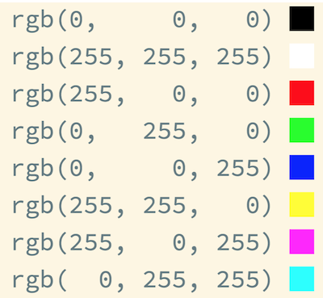
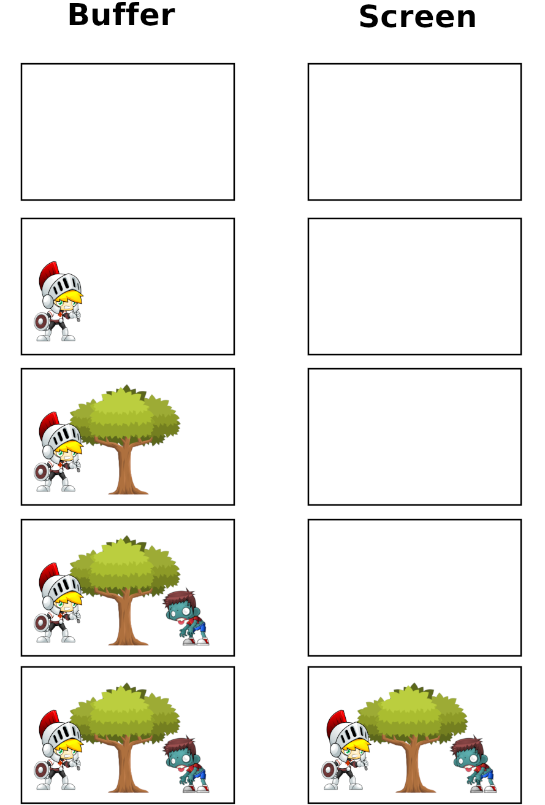

# Цвета в компьютере

Все цвета в компьютере представляются с помощью смешения 3 базовых цветов: Красного, Зелёного и Синего. Англиское сокращение RGB


Для отображения почти всех цветов достаточно 255 оттенков каждого цвета. Оттенок - это то, насколько ярко светится цвет. Т.е. 0 - это нулевая светимость, т.е. полностью темный, черный, несветящийся цвет. А 255 - это полная светимость, т.е. цвет полностью отображается на 100%.



Полностью черный цвет - это когда ни один из 3 основных цветов не светится. А полностью белый - это когда светятся одновременно все цвета.

255 оттенков для каждого из трёх цветов позволяет нам отобразить , больше 18 миллионов различных цветов:

```
256 * 256 * 256 = 16,777,216
```

# Спрайты

В 2d играх используются спрайты. Спрайт - это большая картинка в которой находятся все необходимые картинки для анимиции и отображения игровых объектов в игре. Т.е. все кадры для вашего игрока, все враги, все спецеффекты.

Игровой движок загружает необходимые спрайты, а потом отображает часть картинки в том месте, где это необходимо. Также фон у спрайта может быть вырезан и заменён прозрачным цветом


# Double buffering

При Double Buffering мы сначала рисуем в буфере, а потом готовую сцену отображаем на экран. В pygame это реализовано с помощью метода `flip`




# Pygame

pygame - это специальная библиотека, которая поможет при работе с:

- Графика и анимации (assets)
- Звуки и музыка
- Управление (клавиатура, мышь)

С помощью неё работа с такими вещами становится проще.

# Game loop (игровой цикл)

Это бесконечно повторяющийся цикл из 3 составляющих:

1. Process input events (Обработка ввода) - Все события клавиатуры, мыши, события выхода из игры происходят тут.

2. Update game (Обновление) - Здесь всё что связано непосредственно с игрой. Все перемещения, физика, обработка коллизий, взрывы и т.п.

3. Render or Draw (Рендер или отрисовка) - Здесь мы выводим на экран все спрайты, менюшки и т.п. Т.е. отображаем их.

## Clock

Важным моментом в игре является то, что она не должна быть слишком быстрой. Т.е. мы хотим, чтобы наша игра работала примерно с одинаковой скоростью на супер быстрых компьютерах и на более медленных. Для этого используют параметр FPS, что значит Frames Per Second. Это Количество кадров в секуду, которые мы хотим отрисовывать, но не больше. Если сделать больше, то игра будет слишком быстрой. Меньше - будет тормозить. Оптимальным считается 60 кадров в секунду, т.е. FPS = 60
